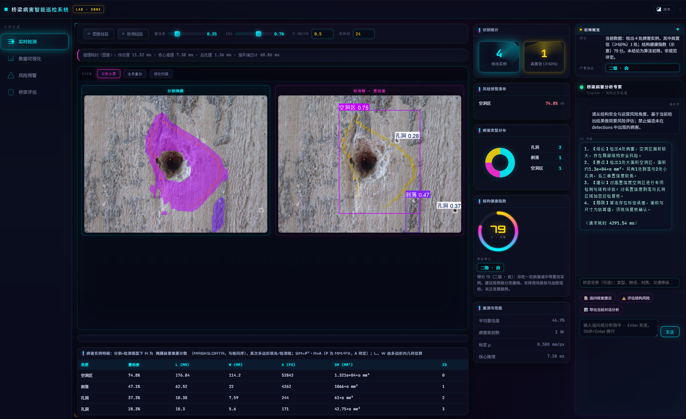

# Mamba-YOLO26 · 桥梁病害智能巡检

基于 [Ultralytics YOLO](https://github.com/ultralytics/ultralytics) 的定制仓库，面向 **DACL10k 等桥梁病害数据** 的训练与推理；内置 **FastAPI + 静态前端** 的「桥梁病害智能巡检系统」，支持 ONNX 分割/检测可视化、统计仪表盘与可选大模型（DeepSeek / OpenAI 兼容）对话分析。

> **English (short):** Custom Ultralytics fork for bridge defect segmentation/detection, plus a web console (`bridge_inspection/`) with ONNX inference, charts, and optional LLM copilot.

---

## 界面预览




---

## 功能概览

| 模块 | 说明 |
|------|------|
| **Ultralytics 定制** | 含 MoE 等实验性改动（见 `ultralytics/`），可按项目内 YAML 训练分割/检测模型。 |
| **桥梁 Web 服务** | `bridge_inspection/`：上传图像或视频采样帧推理，双视图（分割掩膜 / 检测框）、明细表、类型分布、健康指数示意、风险清单。 |
| **AI 专家 (Copilot)** | 可选调用大模型生成四段式分析；支持追问、`user_question` 多轮上下文（见 `app.py`）。 |
| **界面** | 深色/浅色主题切换（本地存储 `bridge_theme_v1`），侧栏工作分区导航。 |
| **ONNX GPU** | ORT 1.24+ 需 CUDA 12 + cuDNN 9；详见 `bridge_inspection/requirements-onnx-gpu-cuda12.txt` 与 `run_uvicorn_gpu.sh`。 |

---

## 环境要求

### 作者当前开发与验证环境（实测）

以下为本仓库在 **Linux x86_64** 上实际跑通训练 / Web / ONNX GPU 推理时的环境快照，便于他人对齐或排查差异。

| 项 | 版本或配置 |
|----|------------|
| **Python** | **3.12.3** |
| **PyTorch** | **2.3.0+cu121** |
| **torchvision** | **0.18.0+cu121** |
| **NumPy** | **1.26.4**|
| **OpenCV** | **4.11.0**（`opencv-python` ） |
| **FastAPI** | **0.135.3** |
| **ONNX Runtime** | **1.24.4**，可用执行提供器：`CUDAExecutionProvider`、`TensorrtExecutionProvider`、`CPUExecutionProvider` |
| **GPU** | **NVIDIA GeForce RTX 4090**（24 GB 显存） |

安装与当前 PyTorch 栈接近的 CUDA 12.1 版本可参考（请按 [PyTorch 官网](https://pytorch.org/get-started/locally/) 更新索引 URL）：

```bash
pip install torch==2.3.0 torchvision==0.18.0 --index-url https://download.pytorch.org/whl/cu121
```

ONNX GPU 侧需 **CUDA 12 + cuDNN 9** 与 `onnxruntime-gpu` 匹配；本环境使用 ORT 1.24.x 时已能加载 `CUDAExecutionProvider`。若本机缺库，可用 `bridge_inspection/run_uvicorn_gpu.sh` 补全 `LD_LIBRARY_PATH`。

### 一般兼容说明（非必须与本表完全一致）

- **Python**：`pyproject.toml` 声明 **`>=3.8`**；上游 Ultralytics 亦支持 3.8–3.12。**Web 子项目**在作者环境下以 **3.12** 验证。
- **训练 / 推理**：需 **PyTorch** 与 **torchvision**（版本组合建议与官方文档或上表同一代 CUDA 对齐）。
- **桥梁 Web**：在 `bridge_inspection/` 下执行 **`pip install -r requirements.txt`**，会对仓库根目录执行 **editable 安装 `ultralytics`（`-e ..`）**。
- **NumPy**：Web 依赖文件将 NumPy 限制在 **1.x**（如 `>=1.26.4,<2`），避免与部分 OpenCV / 检测后处理组合冲突。

---

## 快速开始：桥梁巡检 Web

```bash
cd bridge_inspection
pip install -r requirements.txt
# 将导出的 ONNX 置于 weights/best.onnx（或通过环境变量指定路径，见 app.py 说明）
uvicorn app:app --host 0.0.0.0 --port 8080
```

浏览器访问 `http://127.0.0.1:8080`（或对应主机 IP）。

**GPU 上跑 ONNX（推荐脚本，自动补全 `LD_LIBRARY_PATH` 中的 cuDNN 等）：**

```bash
cd bridge_inspection
./run_uvicorn_gpu.sh
```

**大模型（可选）：** 复制 `bridge_inspection/.env.example` 为 `.env`，填入 `DEEPSEEK_API_KEY` 或 `OPENAI_API_KEY` 等；详见 `app.py` 顶部注释。

---

## 训练与导出（简要）

- 数据集配置示例：`ultralytics/cfg/datasets/dacl10k.yaml` 等。
- 训练脚本可参考仓库内 `train_yolo.py`（按本地路径与模型 YAML 调整）。
- ONNX 导出可参考 `export_yolo_moe_onnx.py`（若使用 MoE 等自定义结构，请与当前 `ultralytics` 版本对齐）。

具体命令与超参请结合你本地的数据路径与模型配置修改。

---

## 目录结构（核心）

```
mamba-yolo26/
├── ultralytics/           # 定制 Ultralytics 源码（pip install -e .）
├── bridge_inspection/     # 桥梁 Web：FastAPI + static/
│   ├── app.py
│   ├── static/            # 前端（index.html / style.css / app.js）
│   ├── requirements.txt
│   ├── run_uvicorn_gpu.sh
│   └── requirements-onnx-gpu-*.txt
├── train_yolo.py
├── export_yolo_moe_onnx.py
├── pyproject.toml
├── README.md              # 本文件
└── README.zh-CN.md        # 上游 Ultralytics 中文说明（保留）
```

---

## API 摘要（Web）

| 路径 | 说明 |
|------|------|
| `GET /` | 前端单页 |
| `GET /api/health` | 模型与 LLM 配置探测 |
| `POST /api/predict_image` | 图像推理 |
| `POST /api/predict_video` | 视频采样推理 |
| `POST /api/agent` | 大模型分析（JSON：`detections` / `summary` / `user_question` 等） |

---

## 许可证与致谢

- 本仓库继承 **Ultralytics** 相关代码的许可，请参阅根目录 **`pyproject.toml`** 与 **`LICENSE`**（AGPL-3.0 等）。
- 若使用官方文档与资源，请遵循 [Ultralytics](https://github.com/ultralytics/ultralytics) 的版权与许可要求。
- 桥梁病害数据集（如 DACL10k）请遵循其原始论文与数据使用协议。

---

## 常见问题

1. **ONNX 有 GPU 但仍走 CPU**  
   勿同时安装 `onnxruntime` 与 `onnxruntime-gpu`；保证 `libcudnn.so.9` 等可被加载（`run_uvicorn_gpu.sh` 或正确设置 `LD_LIBRARY_PATH`）。详见 `bridge_inspection/app.py` 内说明。

2. **NumPy 版本**  
   `bridge_inspection/requirements.txt` 将 NumPy 限制在 1.x，以避免与部分 OpenCV / Ultralytics 组合不兼容。

---

如有问题或改进建议，欢迎通过 **GitHub Issues** 交流。
